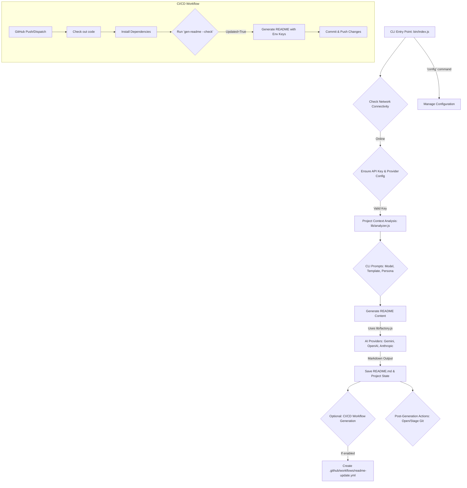

# 🚀 README Genesis Pro: Smart Context-Aware Documentation Engine

<div align="center">

[](LICENSE)
[](package.json)
[](https://nodejs.org/)

</div>

<div align="center">

[Features](#-features) • [Installation](#-installation) • [Usage](#-usage) • [Project Structure](#-project-structure) • [Architecture](#-architecture)

</div>

---

README Genesis Pro is an advanced, AI-powered command-line interface (CLI) tool designed to automatically generate high-quality, context-aware `README.md` files for your projects. It intelligently analyzes your project's structure, dependencies, and git history to craft professional documentation, ensuring your projects are always well-explained and ready for collaboration. With multi-provider AI support and optional CI/CD integration, it streamlines the documentation process, letting you focus on coding.

## ✨ Features

*   **Intelligent Project Analysis**: Deep scans project files, `package.json`, and git history to understand the project's "DNA."
*   **Multi-AI Provider Support**: Seamlessly integrates with Google Gemini, OpenAI (GPT), and Anthropic (Claude) APIs.
*   **Context-Aware Generation**: Generates `README.md` content based on detected project type (Web App, Mobile, Microservice, Backend, Library/CLI, Minimal).
*   **Interactive CLI**: Guides users through configuration, model selection, template styles, and author personas with intuitive prompts.
*   **Automated CI/CD Workflow**: Can optionally generate a GitHub Actions workflow to automatically update your `README.md` on `push` events.
*   **README Update Check**: A `--check` flag allows you to verify if your `README.md` is outdated based on project changes.
*   **Persistent Configuration**: Stores API keys, default AI models, and preferences securely using `Configstore`.
*   **Smart File Reading**: Efficiently reads large source files, extracting key structural elements without bloating the AI prompt.
*   **Network Resilience**: Includes checks for internet connectivity to ensure AI generation can proceed.
*   **Post-Generation Actions**: Offers to open the generated `README.md` or stage it for Git commit.

## 🛠️ Tech Stack

*   **Node.js**: Runtime environment.
*   **Commander.js**: Robust CLI framework for defining commands and options.
*   **Inquirer.js**: Provides an interactive command-line user interface.
*   **Chalk**, **Ora**, **Boxen**: For enhanced and stylized CLI output.
*   **Configstore**: Manages persistent user configurations.
*   **Glob**: For file system pattern matching and project file discovery.
*   **Dotenv**: Loads environment variables from a `.env` file.
*   **AI SDKs**:
    *   `@google/generative-ai`
    *   `openai`
    *   `@anthropic-ai/sdk`
*   **GitHub Actions**: For continuous integration and automated `README.md` updates.

## 🚀 Installation

### 1. Prerequisite: API Key
You need an API Key for one of the supported AI providers (Gemini, OpenAI, Anthropic).
*   **Google Gemini**: Get one for free at [Google AI Studio](https://aistudio.google.com/app/apikey).
*   **OpenAI**: Obtain from the [OpenAI Platform](https://platform.openai.com/api-keys).
*   **Anthropic**: Get from the [Anthropic Console](https://console.anthropic.com/settings/keys).

### 2. Global Installation
To install `readme-genesis` globally and use the `gen-readme` command from any directory:

```bash
npm install -g readme-genesis
```

### 3. Local Development Setup (from source)
If you prefer to run it directly from the source or contribute:

```bash
git clone https://github.com/your-org/Auto-Read-Me.git # Replace with actual repo URL
cd Auto-Read-Me
npm install
npm link # To create a global symlink for 'gen-readme' to this local package
```

## 💡 Usage

### Generate a README
Navigate to your project's root directory and run the command:

```bash
gen-readme
```

The CLI will guide you through:
1.  **API Key Configuration**: If not already set via environment variables (`GEMINI_API_KEY`, `OPENAI_API_KEY`, `ANTHROPIC_API_KEY`) or previous runs, it will prompt you to enter your API key. The tool will automatically detect the provider.
2.  **Project Analysis**: It will analyze your project's code and structure.
3.  **Model Selection**: You'll select an AI model available from your configured provider.
4.  **Documentation Blueprint**: Choose a template style (e.g., Web App, Mobile, Backend).
5.  **Author Persona**: Select an authoring voice (e.g., Student, Senior Engineer, Startup).
6.  **Project Hook**: (Optional) Provide a one-sentence vision for your project.
7.  **CI/CD Workflow**: On first run, it will ask if you want to enable automatic CI/CD workflow generation for future projects.
8.  **Post-Generation**: After generation, you can choose to preview the file or stage it for Git.

### Check if README needs update
To check if your project has changed and the `README.md` might need an update:

```bash
gen-readme --check
```
*   Exits with code `0` if up-to-date.
*   Exits with code `1` if an update is needed.

### Manage Configuration
To reset your API key, clear your default model, or manage CI/CD auto-generation preferences:

```bash
gen-readme config
```
This will present an interactive menu for managing various settings.

### Run Tests
To verify the logic and run the unit test suite:

```bash
npm test
```

## 📁 Project Structure

```
Auto-Read-Me/
├── .agent/
│   └── workflows/
│       └── run.md                  # Workflow documentation for running/testing the CLI
├── .github/
│   └── workflows/
│       ├── readme-update.yml       # GitHub Actions workflow for auto-updating README
│       └── web/
│           ├── .env                # Environment variables for the web demo (e.g., PORT)
│           └── index.html          # Placeholder for web demo/visualizations
├── bin/
│   └── index.js                    # Main CLI entry point (Node.js script)
├── demo_terminal.html              # Interactive terminal demo for marketing/showcase
├── lib/
│   ├── analyzer.js                 # Core logic for project analysis, context gathering, and README generation prompt construction
│   ├── analyzer.test.js            # Unit tests for the analyzer module
│   ├── config.js                   # Centralized configuration (e.g., default AI model)
│   ├── factory.js                  # AI Provider factory to instantiate specific AI clients
│   ├── providers/
│   │   ├── anthropic.js            # Anthropic (Claude) AI provider implementation
│   │   ├── base.js                 # Abstract base class for all AI providers
│   │   ├── gemini.js               # Google Gemini AI provider implementation
│   │   └── openai.js               # OpenAI (GPT) AI provider implementation
│   ├── state.js                    # Manages project state and content hashes for update detection
├── package.json                    # Project metadata, dependencies, scripts
├── package-lock.json               # Lock file for npm dependencies
├── README.md                       # This README file
├── server.js                       # (Possibly) A local server for demo or web functionalities
├── templates/
│   └── minimal.js                  # Example README template (more templates are dynamically generated/AI-chosen)
└── test/
    └── full_suite.js               # Full test suite for the project (integration/e2e)
```

## 🏗️ Architecture

The `README Genesis Pro` CLI follows a modular and extensible architecture, designed to be flexible with AI providers and robust in project analysis.

1.  **CLI Entry Point (`bin/index.js`)**:
    *   Initializes the `commander` program, handles arguments, and sets up interactive prompts using `inquirer`.
    *   Manages configuration persistence with `configstore`.
    *   Orchestrates the entire README generation workflow, from network checks to saving the final output.

2.  **Configuration & State Management (`lib/config.js`, `lib/state.js`)**:
    *   `lib/config.js` holds static global configurations like default AI model names.
    *   `lib/state.js` manages the `.readme-genesis.state.json` file, which stores project hashes and last update times for detecting when a README needs to be regenerated.

3.  **Project Analyzer (`lib/analyzer.js`)**:
    *   `findProjectRoot()`: Locates the project's root directory.
    *   `getGitContext()`: Extracts recent Git commit history for context.
    *   `smartRead()`: Intelligently reads file content, truncating large files while retaining structural information to optimize AI prompts.
    *   `detectProjectType()`: Analyzes dependencies and file structure to suggest a project type (e.g., `webapp`, `backend`).
    *   `getProjectContext()`: Aggregates all project data (dependencies, file structure, git history, environment context) into a comprehensive object.
    *   `generateReadmeContent()`: Constructs the detailed prompt for the AI, incorporating all gathered context and user selections, then calls the AI provider.

4.  **AI Provider Abstraction (`lib/providers/base.js`)**:
    *   Defines a common interface (`validate`, `listModels`, `generate`) that all AI providers must implement, ensuring interchangeability.

5.  **AI Provider Implementations (`lib/providers/gemini.js`, `lib/providers/openai.js`, `lib/providers/anthropic.js`)**:
    *   Concrete implementations for interacting with Google Gemini, OpenAI, and Anthropic APIs.
    *   Includes error handling, such as exponential backoff for rate limits.

6.  **Provider Factory (`lib/factory.js`)**:
    *   Responsible for creating instances of specific AI providers based on a given provider name or by attempting to `detectProvider()` from an API key prefix.

7.  **CI/CD Integration (`.github/workflows/readme-update.yml`)**:
    *   An optional GitHub Actions workflow that can be generated by the CLI.
    *   Automates the `gen-readme --check` command to detect changes and `gen-readme` to regenerate and commit updates to the `README.md` and `.readme-genesis.state.json` files on `main`/`master` branch pushes.

